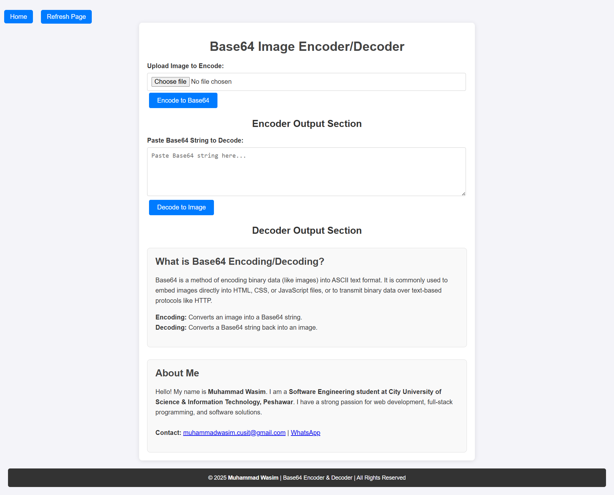

# 📸 Base64 Image Encoder/Decoder

A simple and efficient tool for converting images to and from Base64 format. Base64 encoding is a powerful technique for embedding images directly into HTML, CSS, or JavaScript without requiring separate image files. This tool was built to make the process seamless, fast, and accessible for everyone.

---

## ✨ Features

- 🔁 Convert images to Base64 format
- 🔓 Decode Base64 back to original image
- 📤 Drag & drop support for easy file uploads
- 📋 Copy Base64 output to clipboard
- 💻 Works in any modern web browser
- 🧩 Lightweight and user-friendly interface

---

## 🚀 Live Demo

👉 [Click here to try it out](https://wasim-cusit.github.io/MR_flashcard/)

---

## 🔧 Technologies Used

- HTML5
- CSS3 / TailwindCSS (if applicable)
- JavaScript (Vanilla)
- FileReader & Blob APIs

---

## 🖼️ Screenshots



---

## 📦 Installation

Clone the repository and open the `index.html` file in your browser.

```bash
git clone https://github.com/wasim-cusit/Base64-Image-Encoder-Decoder.git
cd Base64-Image-Encoder-Decoder
